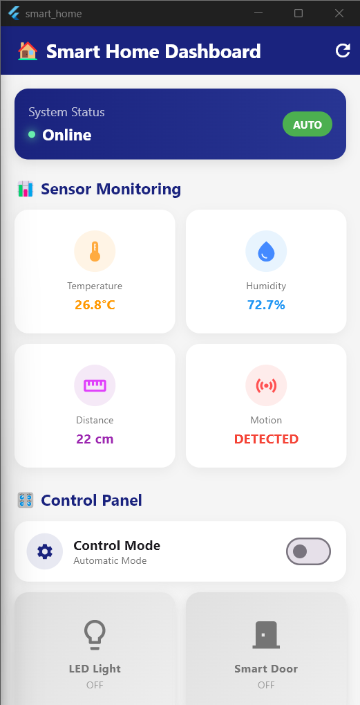

# 🏠 Smart Home IoT Dashboard

Sistem Smart Home IoT terintegrasi yang terdiri dari **ESP32 Microcontroller** dengan RTOS (Real-Time Operating System) dan **Flutter Mobile App** untuk monitoring dan kontrol perangkat secara real-time dengan multiple protokol komunikasi (Blynk, MQTT, REST API).

<p align="center">
  
</p>

## 🎯 Project Overview

Project ini merupakan sistem Smart Home lengkap dengan arsitektur multi-layer:

### 1️⃣ **Hardware Layer (ESP32)**
- **Lokasi Source Code**: `smarthome/smarthome.ino`
- **Microcontroller**: ESP32 (Dual-Core)
- **RTOS**: FreeRTOS dengan 8 concurrent tasks
- **Sensors & Actuators**:
  - DHT22 (Temperature & Humidity)
  - HC-SR04 (Ultrasonic Distance)
  - PIR Sensor (Motion Detection)
  - LED & Servo Motor
  - LCD I2C Display 16x2

### 2️⃣ **Communication Layer**
- **Blynk IoT Platform** - Cloud-based remote monitoring
- **MQTT Protocol** (broker.emqx.io) - Pub/Sub messaging
- **REST API Web Server** - Local HTTP endpoint (Port 80)
- **WiFi Connectivity** - ESP32 Station Mode

### 3️⃣ **Application Layer (Flutter)**
- **Mobile App** - Cross-platform (Android/iOS)
- **Local Web Dashboard** - Responsive HTML UI
- **Real-time Updates** - Auto-refresh & WebSocket ready

## ✨ Features

### 📊 Real-time Monitoring
- **Temperature Sensor** - Monitor suhu ruangan (°C)
- **Humidity Sensor** - Monitor kelembaban udara (%)
- **Distance Sensor** - Deteksi jarak dengan ultrasonik (cm)
- **Motion Sensor** - Deteksi pergerakan PIR sensor

### 🎛️ Remote Control
- **LED Control** - Nyalakan/matikan lampu dari jarak jauh
- **Smart Door** - Buka/tutup pintu otomatis
- **Mode Switching** - Toggle antara AUTO dan MANUAL mode

### 📱 Device Information
- IP Address & MAC Address
- WiFi SSID & Signal Strength (RSSI)
- Device Uptime & Version Info

### 🔄 Auto-Refresh
- Data sensor update otomatis setiap 2 detik
- Pull-to-refresh untuk manual update
- Real-time status indicator

## 🏗️ Architecture

### System Architecture Diagram
```
┌─────────────────────────────────────────────────────────────┐
│                     SMART HOME SYSTEM                        │
├─────────────────────────────────────────────────────────────┤
│                                                              │
│  ┌────────────────────────────────────────────────────┐    │
│  │         ESP32 Microcontroller (RTOS)               │    │
│  │         Source: smarthome/smarthome.ino            │    │
│  ├────────────────────────────────────────────────────┤    │
│  │  TASK 1: Sensor Reading (DHT22, PIR, Ultrasonic)  │    │
│  │  TASK 2: LED Control (Auto/Manual Mode)           │    │
│  │  TASK 3: Servo Door Control                       │    │
│  │  TASK 4: LCD Display Update                       │    │
│  │  TASK 5: Data Broadcasting (Blynk + MQTT)         │    │
│  │  TASK 6: Blynk Connection Handler                 │    │
│  │  TASK 7: Web Server (Port 80)                     │    │
│  │  TASK 8: MQTT Client (broker.emqx.io)             │    │
│  └────────────────────────────────────────────────────┘    │
│                       │                                      │
│          ┌────────────┼────────────┐                        │
│          │            │            │                        │
│    ┌─────▼─────┐ ┌───▼────┐ ┌────▼─────┐                  │
│    │   Blynk   │ │  MQTT  │ │ REST API │                  │
│    │  Cloud    │ │ Broker │ │  Server  │                  │
│    └─────┬─────┘ └───┬────┘ └────┬─────┘                  │
│          │            │            │                        │
│    ┌─────▼──────────────▼──────────▼─────┐                │
│    │     Flutter Mobile Application       │                │
│    │     Source: lib/*                    │                │
│    └──────────────────────────────────────┘                │
│                                                              │
└─────────────────────────────────────────────────────────────┘
```

### ESP32 Microcontroller Architecture (smarthome/smarthome.ino)

#### 🔧 Hardware Configuration
```cpp
// PIN Definitions
DHT22 Sensor     → GPIO 4   (Temperature & Humidity)
PIR Sensor       → GPIO 18  (Motion Detection)
LED              → GPIO 5   (Light Control)
Ultrasonic TRIG  → GPIO 19  (Distance Measurement)
Ultrasonic ECHO  → GPIO 23
Servo Motor      → GPIO 2   (Door Control)
LCD I2C          → SDA/SCL  (Display)
```

#### ⚙️ RTOS Task Management
```cpp
Core 0 (Protocol CPU):
├─ taskBacaSensor      (Priority 2) - Read all sensors every 2s
├─ taskKontrolLampu    (Priority 2) - LED logic control
├─ taskKontrolPintu    (Priority 2) - Servo motor control
└─ taskUpdateLCD       (Priority 1) - LCD refresh every 3s

Core 1 (Application CPU):
├─ taskBroadcastData   (Priority 1) - Send data to Blynk & MQTT
├─ taskBlynkRun        (Priority 2) - Blynk connection manager
├─ taskWebServer       (Priority 1) - HTTP request handler
└─ taskMqtt            (Priority 2) - MQTT pub/sub handler
```

#### 🔐 Thread-Safe Communication
- **Semaphore Mutex**: `sensorDataMutex` - Protects shared sensor data
- **Task Notifications**: Inter-task communication untuk broadcast trigger
- **Non-blocking I/O**: Semua tasks menggunakan `vTaskDelay()` untuk CPU efficiency

#### 📡 Communication Protocols

**1. Blynk IoT (Cloud Platform)**
```cpp
Virtual Pins:
V0 → Mode Control (Auto/Manual)
V1 → LED State (ON/OFF)
V2 → Temperature Reading
V3 → Humidity Reading
V4 → Door Control (Open/Close)
V5 → Distance Reading
V6 → Motion State
```

**2. MQTT Protocol (Message Queuing)**
```cpp
Topics:
├─ smart_home/status       (Publish) - JSON sensor data
├─ smart_home/mode/set     (Subscribe) - Mode control
├─ smart_home/led/set      (Subscribe) - LED control
└─ smart_home/door/set     (Subscribe) - Door control

Broker: broker.emqx.io:1883
QoS Level: 0 (Fire and forget)
```

**3. REST API (Local Web Server)**
```cpp
Endpoints:
GET /                  → HTML Dashboard UI
GET /api/status       → JSON sensor data
GET /api/mode?val=X   → Change mode (0=AUTO, 1=MANUAL)
GET /api/led?val=X    → Control LED (0=OFF, 1=ON)
GET /api/door?val=X   → Control door (0=CLOSE, 1=OPEN)
OPTIONS /*            → CORS preflight
```

### Flutter Mobile App Architecture (lib/)

```
lib/
├── main.dart                      # App Entry Point
├── controllers/                   # Business Logic Layer
│   └── dashboard_controller.dart  # State management dengan ChangeNotifier
├── services/                      # Data Layer
│   ├── api_service.dart          # REST API client untuk ESP32
│   └── mqtt_service.dart         # MQTT client handler
├── components/                    # Atomic UI Components
│   ├── status_header.dart        # WiFi & connection status
│   ├── section_title.dart        # Section headers
│   ├── sensor_card.dart          # Individual sensor display
│   ├── mode_control.dart         # Auto/Manual mode toggle
│   ├── control_card.dart         # LED/Door control buttons
│   └── device_info_card.dart     # Device metadata display
├── widgets/                       # Composite Widgets
│   ├── error_widget.dart         # Error boundary & retry UI
│   ├── sensor_grid.dart          # Grid layout untuk sensors
│   └── control_grid.dart         # Grid layout untuk controls
└── pages/                         # Screen Pages
    └── dashboard.dart            # Main dashboard screen
```

### Design Patterns & Best Practices

#### ESP32 Firmware (C++)
- ✅ **RTOS Pattern** - FreeRTOS concurrent task execution
- ✅ **Producer-Consumer** - Sensor task produces, control tasks consume
- ✅ **Observer Pattern** - Task notifications untuk event-driven updates
- ✅ **Mutex Synchronization** - Thread-safe shared resource access
- ✅ **State Machine** - Mode switching (AUTO ↔ MANUAL)

#### Flutter App (Dart)
- ✅ **MVC Pattern** - Model-View-Controller separation
- ✅ **Observer Pattern** - ChangeNotifier untuk reactive UI
- ✅ **Repository Pattern** - ApiService sebagai data abstraction layer
- ✅ **Component-Based** - Reusable & composable UI widgets
- ✅ **Dependency Injection** - Services injected via constructor

## 🚀 Getting Started

### Prerequisites
- Flutter SDK (3.8.1 atau lebih baru)
- Dart SDK
- Node.js (untuk mock server)
- Android Studio / VS Code
- Android device atau emulator

### Installation

#### 🔧 Part 1: Upload Firmware ke ESP32

1. **Install Arduino IDE & ESP32 Board**
   - Download Arduino IDE dari https://www.arduino.cc/en/software
   - Install ESP32 board support:
     - File → Preferences → Additional Board Manager URLs
     - Add: `https://dl.espressif.com/dl/package_esp32_index.json`
     - Tools → Board → Boards Manager → Search "ESP32" → Install

2. **Install Required Libraries** (via Library Manager)
   ```
   - WiFi (built-in)
   - Wire (built-in)
   - LiquidCrystal_I2C by Frank de Brabander
   - DHT sensor library by Adafruit
   - ESP32Servo by Kevin Harrington
   - Blynk by Volodymyr Shymanskyy
   - WebServer (built-in ESP32)
   - PubSubClient by Nick O'Leary (MQTT)
   ```

3. **Upload Firmware ke ESP32**
   - Buka file **`smarthome/smarthome.ino`** di Arduino IDE
   - Edit konfigurasi WiFi (line 24-25):
     ```cpp
     const char* ssid = "YOUR_WIFI_SSID";
     const char* password = "YOUR_WIFI_PASSWORD";
     ```
   - Edit Blynk Token (line 9):
     ```cpp
     #define BLYNK_AUTH_TOKEN "YOUR_BLYNK_TOKEN"
     ```
   - Pilih board: Tools → Board → ESP32 Dev Module
   - Pilih port: Tools → Port → (pilih port COM ESP32)
   - Upload: Sketch → Upload (Ctrl+U)
   - Open Serial Monitor (Ctrl+Shift+M) untuk melihat IP address ESP32

4. **Catat IP Address ESP32**
   - Setelah upload berhasil, buka Serial Monitor (115200 baud)
   - Tunggu sampai WiFi connected
   - Catat IP address yang muncul (contoh: `192.168.1.100`)

#### 📱 Part 2: Setup Flutter Mobile App

1. **Clone repository**
   ```bash
   git clone https://github.com/zalzdarkent/smart_home_mobile.git
   cd smart_home_mobile
   ```

2. **Install dependencies**
   ```bash
   flutter pub get
   npm install  # untuk mock server (optional)
   ```

3. **Setup environment variables**
   ```bash
   cp .env.example .env
   ```
   Edit `.env` dengan IP address ESP32:
   ```env
   # Gunakan IP address ESP32 yang sudah dicatat
   BASE_URL=http://192.168.1.100
   
   # Atau gunakan mock server untuk testing
   # BASE_URL=http://localhost:3000
   ```

4. **Run aplikasi Flutter**
   
   **Option A: Dengan ESP32 Hardware**
   ```bash
   # Pastikan .env sudah diisi dengan IP ESP32
   flutter run
   ```
   
   **Option B: Testing dengan Mock Server** (tanpa ESP32)
   ```bash
   # Terminal 1: Jalankan mock server
   node server.js
   
   # Terminal 2: Run Flutter app
   flutter run
   ```

5. **Access Web Dashboard** (Optional)
   - Buka browser di device yang sama network dengan ESP32
   - Akses: `http://192.168.1.100` (ganti dengan IP ESP32 Anda)
   - Web dashboard akan tampil dengan UI modern seperti di gambar

## 🔧 Configuration

### Environment Variables
File `.env` digunakan untuk konfigurasi sensitive data:
- `BASE_URL` - URL endpoint API server

> ⚠️ **Note**: File `.env` tidak di-commit ke Git. Gunakan `.env.example` sebagai template.

### API Endpoints

Mock server menyediakan endpoint:
- `GET /status` - Get sensor data real-time
- `GET /api/info` - Get device information
- `GET /set?led=1` - Control LED (0=OFF, 1=ON)
- `GET /set?door=1` - Control Door (0=CLOSE, 1=OPEN)
## 📝 API Mock Server (server.js)

Server simulasi Node.js untuk testing tanpa hardware ESP32:

**Features:**
- Auto-update sensor data setiap 2 detik
- Simulasi temperature: 25-30°C
- Simulasi humidity: 60-80%
- Simulasi distance: 10-50cm
- Random motion detection
- CORS enabled untuk cross-origin requests

**Usage:**
```bash
node server.js
# Server running at http://localhost:3000
```

**Endpoints (sama dengan ESP32):**
```
GET /status        → Sensor data JSON
GET /api/info      → Device information
GET /set?led=1     → Control LED
GET /set?door=1    → Control door
GET /set?mode=1    → Change mode
```

## 🔌 Hardware Wiring Diagram

```
ESP32 Pin Mapping:
┌─────────────────────────────────────────┐
│ GPIO 4  → DHT22 Data Pin               │
│ GPIO 18 → PIR Sensor Output            │
│ GPIO 5  → LED Anode (+)                │
│ GPIO 19 → Ultrasonic TRIG              │
│ GPIO 23 → Ultrasonic ECHO              │
│ GPIO 2  → Servo Motor Signal           │
│ GPIO 21 → LCD I2C SDA                  │
│ GPIO 22 → LCD I2C SCL                  │
│ 3.3V    → Sensor VCC (DHT22, PIR)     │
│ 5V      → Servo & LCD VCC              │
│ GND     → All GND pins                 │
└─────────────────────────────────────────┘
```

## 🔐 Security & Configuration

**Credentials Management:**
- Blynk Token di `smarthome.ino` line 9
- WiFi credentials di line 24-25
- MQTT broker: `broker.emqx.io` (public, no auth)
- API endpoints: No authentication (local network only)

**Important Notes:**
- ⚠️ Jangan push Blynk token ke public repository
- ⚠️ WiFi password harus diganti sebelum upload
- ⚠️ MQTT menggunakan public broker (tidak encrypted)
- ⚠️ REST API tidak ada authentication (hanya untuk local network)ons: ^1.0.8    # iOS style icons
```

## 🎨 UI/UX Features

- **Modern Design** - Clean dan minimalist interface
- **Gradient Cards** - Beautiful card design dengan shadow
- **Color-Coded Status** - Visual indicator untuk setiap sensor
- **Responsive Layout** - Grid layout yang adaptive
- **Smooth Animations** - Transition & interaction yang smooth
- **Error Handling** - User-friendly error messages

## 📱 Screenshots

### Dashboard View

<p align="center">
  
</p>

*Real-time monitoring dengan kontrol panel yang intuitif*

## 🔐 Security

- ✅ Environment variables untuk sensitive data
- ✅ `.env` file excluded dari Git
- ✅ Private getter untuk base URL
- ✅ Error handling yang aman

## 🛠️ Development

### Complete Project Structure
```
smart_home/
├── smarthome/                     # 📟 ESP32 MICROCONTROLLER
│   └── smarthome.ino             #    ★ MAIN FIRMWARE SOURCE CODE ★
│                                  #    - FreeRTOS 8 concurrent tasks
│                                  #    - Blynk + MQTT + REST API
│                                  #    - Sensor reading & actuator control
│                                  #    - Web server with modern UI
│
├── lib/                           # 📱 FLUTTER MOBILE APP
│   ├── main.dart                 #    App entry point
│   ├── controllers/              #    Business logic & state management
│   │   └── dashboard_controller.dart
│   ├── services/                 #    API & network communication
│   │   ├── api_service.dart     #    REST API client
│   │   └── mqtt_service.dart    #    MQTT client (optional)
│   ├── components/               #    Reusable UI components
│   │   ├── status_header.dart
│   │   ├── sensor_card.dart
│   │   ├── mode_control.dart
│   │   ├── control_card.dart
│   │   └── device_info_card.dart
│   ├── widgets/                  #    Composite widgets
│   │   ├── error_widget.dart
│   │   ├── sensor_grid.dart
│   │   └── control_grid.dart
│   └── pages/                    #    Screen pages
│       └── dashboard.dart
│
├── server.js                      # 🖥️ MOCK API SERVER (Node.js)
│                                  #    Testing tanpa hardware ESP32
│
├── public/evidence/              # 📸 SCREENSHOTS & ASSETS
│   └── image.png
│
├── android/                       # 📦 ANDROID BUILD CONFIG
├── ios/                           # 📦 IOS BUILD CONFIG
├── web/                           # 🌐 WEB BUILD CONFIG
├── windows/                       # 💻 WINDOWS BUILD CONFIG
├── linux/                         # 🐧 LINUX BUILD CONFIG
├── macos/                         # 🍎 MACOS BUILD CONFIG
│
├── .env                           # 🔐 ENVIRONMENT CONFIG (gitignored)
├── .env.example                  # 📋 Template environment
├── pubspec.yaml                  # 📦 Flutter dependencies
├── analysis_options.yaml         # 🔍 Dart linter config
├── MQTT_MIGRATION.md             # 📚 MQTT integration guide
└── README.md                     # 📖 This documentation
```

### 🎯 Key Files Explained

#### 1. **smarthome/smarthome.ino** (674 lines) - MOST IMPORTANT!
```cpp
// ESP32 Firmware dengan FreeRTOS
// Mengontrol semua hardware sensors & actuators
// Menyediakan 3 protokol komunikasi:
//   - Blynk Cloud API
//   - MQTT Pub/Sub
//   - REST API Web Server
//
// Features:
// ✅ Multi-tasking dengan 8 concurrent tasks
// ✅ Thread-safe dengan semaphore mutex
// ✅ Auto/Manual mode switching
// ✅ Web dashboard dengan modern UI
// ✅ Error handling untuk sensor DHT22
// ✅ Watchdog & connection recovery
```

#### 2. **lib/main.dart** - Flutter App Entry
```dart
// Initialize app, setup theme, routes
// Load environment variables dari .env
```

#### 3. **lib/controllers/dashboard_controller.dart**
```dart
// Business logic untuk dashboard
// State management dengan ChangeNotifier
// API calls & data transformation
```

#### 4. **lib/services/api_service.dart**
```dart
// HTTP client untuk komunikasi dengan ESP32
// Endpoints: /api/status, /api/mode, /api/led, /api/door
// Error handling & retry logic
```

#### 5. **server.js** - Mock Server (Development Only)
```javascript
// Node.js Express server
// Simulate ESP32 responses untuk testing
// Random sensor data generation
```

### Best Practices Applied

#### Microcontroller (ESP32)
- ✅ **RTOS Multi-tasking** - Parallel task execution
- ✅ **Mutex Synchronization** - Prevent race conditions
- ✅ **Non-blocking Operations** - Efficient CPU usage
- ✅ **Error Recovery** - Automatic reconnection untuk WiFi/MQTT
- ✅ **Watchdog Pattern** - Monitor task health
- ✅ **State Machine** - Clean mode switching logic

#### Mobile App (Flutter)
- ✅ **Clean Architecture** - Separation of concerns
- ✅ **SOLID Principles** - Maintainable & scalable code
- ✅ **DRY (Don't Repeat Yourself)** - Component reusability
- ✅ **Component-based Development** - Modular UI
- ✅ **Environment Configuration** - Secure credential management
- ✅ **Error Boundary** - Graceful error handling

## 📝 API Mock Server

Server simulasi untuk testing tanpa hardware ESP32:
- Auto-update sensor data setiap 2 detik
- Simulasi temperature: 25-30°C
- Simulasi humidity: 60-80%
- Simulasi distance: 10-50cm
- Random motion detection
- CORS enabled

## 🤝 Contributing

Contributions are welcome! Silakan buat Pull Request atau Issue.

## 👨‍💻 Author

**Zalz Darkent**
- GitHub: [@zalzdarkent](https://github.com/zalzdarkent)
- Repository: [smart_home_mobile](https://github.com/zalzdarkent/smart_home_mobile)

## 📄 License

This project is for educational purposes (UTS IoT Project).

## 🙏 Acknowledgments

- Flutter Team untuk framework yang amazing
- Material Design untuk design guidelines
- Node.js & Express untuk mock server

---

**Built with ❤️ using Flutter**
